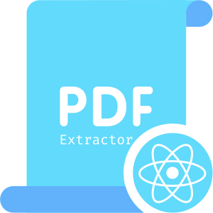

# react-native-pdf-extractor

This library allows you to extract pdfs file data using matches specifics patterns.

## [Documentation](https://1fabiopereira.github.io/react-native-pdf-extractor/)
- ### [Getting Started](https://1fabiopereira.github.io/react-native-pdf-extractor/docs/before-you-start)
    - [Before you start](https://1fabiopereira.github.io/react-native-pdf-extractor/docs/before-you-start)
    - [Installation](https://1fabiopereira.github.io/react-native-pdf-extractor/docs/installation)
    - [Configuration](https://1fabiopereira.github.io/react-native-pdf-extractor/docs/configuration)
    - [Usage](https://1fabiopereira.github.io/react-native-pdf-extractor/docs/usage)
     - [Playground app](https://1fabiopereira.github.io/react-native-pdf-extractor/docs/playground)
- ### [API](https://1fabiopereira.github.io/react-native-pdf-extractor/docs/methods)
    - [Methods](https://1fabiopereira.github.io/react-native-pdf-extractor/docs/methods)
    - [Patterns](https://1fabiopereira.github.io/react-native-pdf-extractor/docs/patterns)
- ### [Meta](https://1fabiopereira.github.io/react-native-pdf-extractor/docs/contributing)
    - [Contributing](https://1fabiopereira.github.io/react-native-pdf-extractor/docs/contributing)
    - [License](https://1fabiopereira.github.io/react-native-pdf-extractor/docs/license)